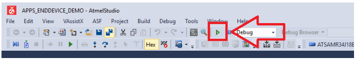

# EMB-LR1276S_TTI
> “Wireless Made Easy!" - Develop with the EMBIT EMB-LR1276S LoRaWAN Module and Microchip LoRaWAN stack on TTI join server

<a href="http://www.embit.eu/products/wireless-modules/emb-lr1276s/" target="_blank">

&nbsp;&nbsp;&nbsp;&nbsp;&nbsp;&nbsp;&nbsp

<a href="https://www.microchip.com/design-centers/security-ics/trust-platform/trust-go/trust-go-lora-secure-authentication-with-join-servers" target="_blank">

&nbsp;&nbsp;&nbsp;&nbsp;&nbsp;&nbsp;&nbsp

<a href="https://www.thethingsindustries.com" target="_blank">

&nbsp;&nbsp;&nbsp;&nbsp;&nbsp;&nbsp;&nbsp

</a>

**This guide will direct you through the process of getting started with developing a secure LoRa end device product using Embit EMB-LR1276S module along with TTI Join server.**
 
The Things Industries created a product and a service that delivers secure join, secure communication and secure key provisioning.

1. [Material required](#step1)
2. [Software](#step2)
3. [Hardware setup](#step3)
4. [Sample Application Code](#step4)
5. [Claiming and Activating the device](#step5)
6. [Running the demo](#step6)

## Material required 

Here we will use the Evaluation Board EMB-LR1276S-Dev_Board from EMBIT. 
This board allows the user to exploit all the capabilities of Embit’s module EMB-LR1276S, simplifying the implementation of a prototype of a LoRa® communication system. 
The board provides a simple connection to a computer or an external processor via USB.  
For testing purpose, several pin headers are present to exploit the capabilities of the module and ease the development of custom designs. 

 

The EMB-LR1276S LoRaWAN module embeds a Microchip SAM R34 LoRa(r) device and the ATECC608A Secure element. 

<a href="http://www.embit.eu/products/wireless-modules/emb-lr1276s/" target="_blank">

&nbsp;&nbsp;&nbsp;&nbsp;&nbsp;&nbsp;&nbsp

<a href="http://www.embit.eu/products/wireless-modules/emb-lr1276s/" target="_blank">

&nbsp;&nbsp;&nbsp;&nbsp;&nbsp;&nbsp;&nbsp

<a href="https://www.microchip.com/wwwproducts/en/ATSAMR34J18" target="_blank">

&nbsp;&nbsp;&nbsp;&nbsp;&nbsp;&nbsp;&nbsp

<a href="https://www.microchip.com/wwwproducts/en/ATECC608A-TNGLORA" target="_blank">

&nbsp;&nbsp;&nbsp;&nbsp;&nbsp;&nbsp;&nbsp

</a>

Purchase the <a href="http://www.embit.eu/products/evaluation-kits/emb-lr1276s-evk/" target="_blank">EMB-LR1276S Evaluation board</a>
 

 

Purchase a LoRa(r) Gateway from <a href="https://www.thethingsindustries.com/technology/hardware#gateway" target="_blank">The Things Industries</a>
 

 

## Software 

- Download and install Atmel Studio 7.0 IDE.  
https://www.microchip.com/mplab/avr-support/atmel-studio-7

- Open Atmel Studio 7.0 IDE.  
- Then, you need Advanced Software Framework (ASFv3) v3.47.0 release or upper release.  
Install ASFv3 as an extension to Atmel Studio from the menu: Tools -> Extensions and Updates …
- Once the installation is complete, you must restart Atmel Studio.  
- Download and install a serial terminal program like Tera Term.  
https://osdn.net/projects/ttssh2/releases/

Note: ASFv3 is an MCU software library providing a large collection of embedded software for AVR® and SAM flash MCUs and Wireless devices. ASFv3 is configured by the ASF Wizard in Atmel Studio 7.0 (installed as an extension to Studio). ASFv3 is also available as a standalone (.zip) with the same content as Studio extension (https://www.microchip.com/mplab/avr-support/advanced-software-framework).

Important:
Until the next Atmel Studio IDE release, you have to manually install the Device Part Pack for developing with SAMR34/R35 on Atmel Studio 7.0 IDE.
(all products released in between IDE releases of Atmel Studio should be manually added by user to develop applications).
- Go to Tools -> Device Pack Manager  
- Check for Updates  
- Search for SAMR34 and click install  
- Repeat the same for SAMR35  
- Restart Atmel Studio 7.0 IDE  

- Download and install Segger J-Link Software and Documentation pack (version 6.42 or higher) 
https://www.segger.com/downloads/jlink/#J-LinkSoftwareAndDocumentationPack
 

## Hardware setup 

- Plug the antenna to the SMA connector ANT
- Attach a USB cable to EMB-LR1276S-DEV_BOARD's CMD_USB micro-B port. The USB ports powers the board and enables the user to communicate with the kits over a serial console.
- Plug the Segger J-Link Lite board to the EMB-LR1276S-DEV_BOARD's JTAG connector (2x10 ways 2.54mm pitch male header)
- Attach a USB cable to J-Link Lite board
 

 

- Wait for USB driver installation and COM ports mounting.  
- Launch Tera Term program and configure the serial ports mounted with: **115200 bps, 8/N/1**

## Sample Application Code 

Open the "APPS_ENDDEVICE_DEMO" project with Atmel Studio 7 IDE 
From the top menu, go to Project -> APPS_ENDDEVICE_DEMO Properties 
From Tool settings, select your board as SAM-ICE with SWD interface 
Make sure to select ATSAMR34J18 from the list 

 
Build and download the project by clicking the empty green "Run without debugging" triangle
 

 
Open the Tera Term UART console previously configured at 115200 bps, 8-data bits/No parity/1-stop bit
 
Press the "Reset" button on the EMB-LR1276S-DEV_BOARD to see output printed to the console
 
Observe the following identifiers coming from the ATECC608A Secure Element
 

 

In order to pre-commission a device using ATECC608A secure element in TTI Activation, the following idenfiers are required:

- DevEUI: LoRaWAN device 64-bit unique identifier assigned by the Device manufacturer (or using Secure Element default value)
- JoinEUI: LoRaWAN JS 64-bit unique identifier of the Join Server on which AppKey of the device is stored

## Claiming and Activating the device 

TTI and Microchip developed a security solution for LoRaWAN that enables secure key provisioning and secure cryptographic operations using secure elements.
 
- <a href="https://www.thethingsindustries.com/technology/security-solution" target="_blank">End-to-end LoRaWAN Security solution</a> 

Claiming and Activating the device within TTI Servers are the next steps described in the guides below: 
- <a href="https://enterprise.thethingsstack.io/v3.3.2/guides/claim-atecc608a/" target="_blank">Claim ATECC608A Secure Elements</a> 
- <a href="https://enterprise.thethingsstack.io/v3.3.2/guides/cloud-hosted/tti-join-server/activate-devices-cloud-hosted/" target="_blank">Activate devices on the Things Industries Cloud Hosted</a> 

You can also refer to the Microchip Workshop which was provided at The Things Conference 2020. 
<a href="https://github.com/MicrochipTech/secure_lorawan_with_tti" target="_blank">“Wireless Made Fun!" - Secure Authentication with SAMR34 & ATECC608A and The Things Industries’s Join Server</a> 

## Running the demo 

Go back to the Tera Term UART console
 

 
Press "1" to start the Demo Application
 
Select the band where your device is operating
 

 
Then, the end device application transmits a Join Request message. If a Join Accept message was received and validated, the SAM R34 Xplained Pro board will be joined to the Join Server.
 

 
Press "2" to send a packet consisting of a temperature sensor reading
 

 

